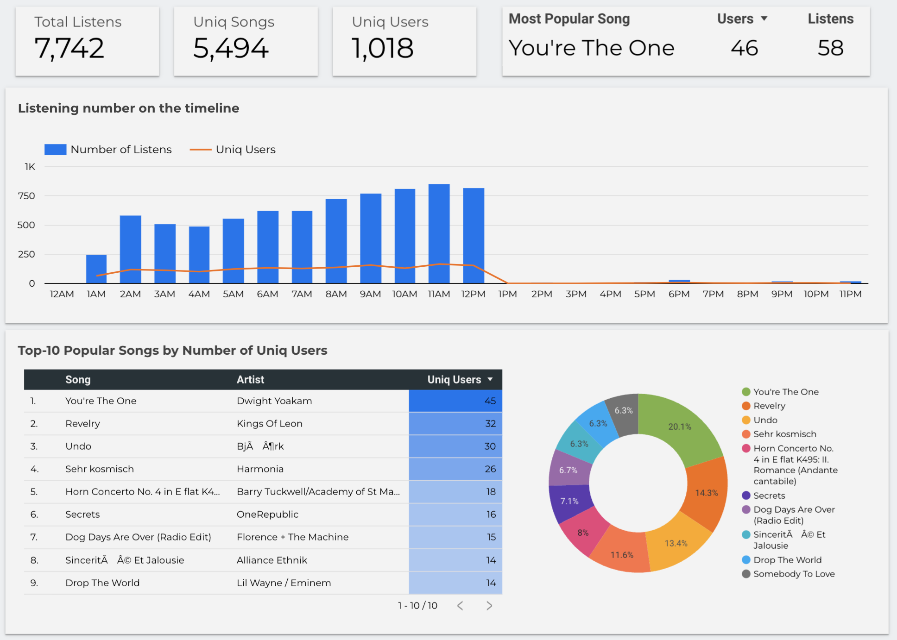

# Data Platform for an Audio Streaming service

This data platform is design to solve the following problems:
- Business Intelligence: prepared data will allow analytics to assess the state of the business at various levels. 
- _[plans]_ Proactive actions based on user activity: architechture should allow making offers to users in the app based on real-time data.

To acchive the goals above the data must meet the following requirements: 
- Data must be in a centralized repository; 
- Events should be written to the storage with a delay of no more than one minute;
- Must reflect business process;
- Must be clean and reliable;
- Must be available 24/7;
- Must be documented.

# Table of Contents

1. [Architecture Design](#architecture-design)
2. [Data Generation](#data-generation)
3. [Data Ingestion](#data-ingestion)
4. [Data Warehouse](#data-warehouse)
5. [BI](#bi)

## Architecture Design

## Data Generation 

The project is based on events generated by https://github.com/viirya/eventsim. This events reflect user behaviour in a fake music web site (like Spotify).
 Launch instructions are here: [https://github.com/iurii-chernigin/audio-streaming-data-platform/eventsim](https://github.com/iurii-chernigin/audio-streaming-data-platform/tree/main/data-generation)

## Data Ingestion

### Kafka Deployment

Kafka is used to store events before they are sent to the data warehouse.

There are two options:
- Deploy Kafka with Google Kubernetes Engine and Terraform: https://github.com/iurii-chernigin/audio-streaming-data-platform/tree/main/infrastructure/terraform#readme
- Deploy Kafka locally in Docker: https://github.com/iurii-chernigin/audio-streaming-data-platform/tree/main/infrastructure/kafka#readme

### Kafka Consumers

Custom Java consumers are used to consume and send events from Kafka topics to Data Warehouse tables.

Link to Java application implementation: https://github.com/iurii-chernigin/audio-streaming-java-consumer/tree/main#readme

## Data Warehouse

Data Warehouse is built on BigQuery: https://github.com/iurii-chernigin/audio-streaming-data-platform/tree/main/data-warehouse#readme

There are three main data layers:
- Raw - raw data ingested from Kafka;
- Core - cleaned and normalized data according to Data Vault 2.0;
- Data Marts - wide tables that are easy to analyze and create reports & dashboards. This is the main entry point into the data for data analysts & scientists.

To transform the data, dbt with the dbtvault library is used: https://github.com/iurii-chernigin/audio-streaming-dbt-datavault

## BI

Looker is used to create reports & dashboards. The dashboard in the picture below is available at the link: https://lookerstudio.google.com/s/iWa4oRy9nc4

### Usefull links

- dbt: [models orchestration with Prefect](https://prefecthq.github.io/prefect-dbt/)
- Terraform: [deploy applications with the Helm provider](https://developer.hashicorp.com/terraform/tutorials/kubernetes/helm-provider)

## Plans

- Try workflow orchestration tool: https://flyte.org/
