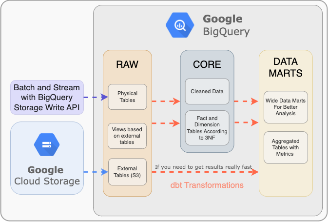
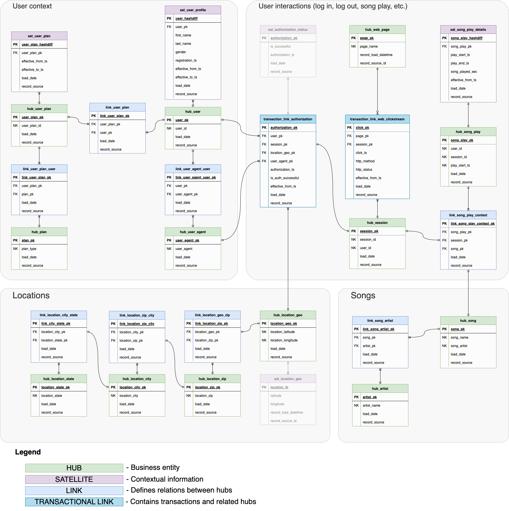
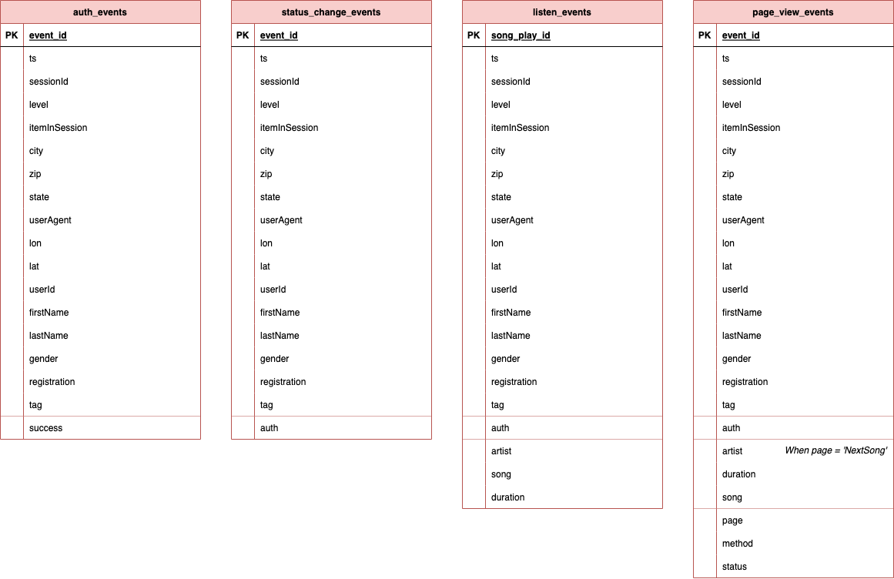

# Data Warehouse Confluence 

## Up Level Diagram

  

  

## Data Areas

### Core

This area contains cleaned and normalized data that reflects business processes, their entities and relationships. 

Data normalized according to the Data Vault 2.0 metology. Implementation is built using dbt with a dbtvault package. 

**Link to dbt implementation**: [audio-streaming-dbt-datavault/models](https://github.com/iurii-chernigin/audio-streaming-dbt-datavault/tree/main/models)

### Data Mart

This area contains tables & views that are useful for analytic research or building machine learning models.

**Link to the dbt models**: [audio-streaming-dbt-datavault/models/datamarts](https://github.com/iurii-chernigin/audio-streaming-dbt-datavault/tree/main/models/datamarts)

| Table    | Description | Optimizations |
| -------- | ------- | ------- |
| mart_song_play  | Wide tables build on top of Data Vault, contains cleaned and verified information about song plays    | - Partitioned by play_start_date, the field is used for selecting dates on the dashboard;  - Clustered by user_id, song_name, location_city, because these fields are used to calculate diffrent metrics (with group by) for downstream data marts |
| mart_song_play_hourly_metrics | Contains song plays metrics that are distributed by date and hour    | - Partitioned by play_date, the field is used for selecting dates on the dashboard |
| mart_song_play_top_10_songs    | Contains metrics on the top-10 listened to songs for each day  | - Partitioned by play_date, the field is used for selecting dates on the dashboard  |

### Raw / Staging 

This area contains data from data sources in raw format. Data looks here as it looks in a source system.

| Table    | Description | Optimizations |
| -------- | ------- | ------- |
| listen_events  | Contains infromations about song listents, one event = one song listened    | - Partitioned by ts (event timestamp), ts field use for batch processing on every day scheduling |
| auth_events | Contains information about user aothorizations (log-ins)    | - Partitioned by ts (event timestamp), ts field use for batch processing on every day scheduling |
| page_view_events    | Contains informations about open pages during the user session    | - Partitioned by ts (event timestamp), ts field use for batch processing on every day scheduling |
| status_change_events    | Contains informations about user account level changes    | - Partitioned by ts (event timestamp), ts field use for batch processing on every day scheduling |

