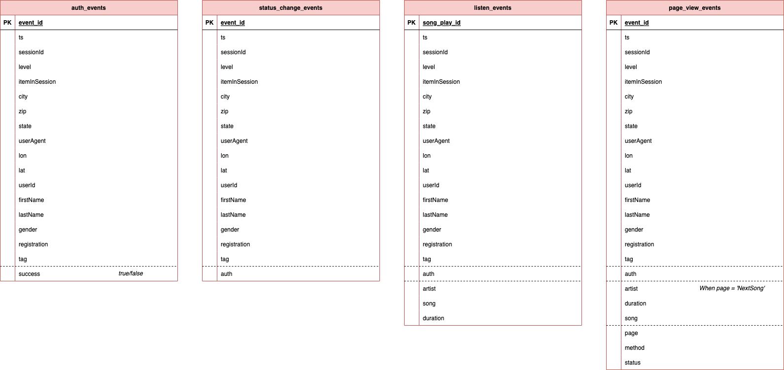

# Data Warehouse Confluence 

## Up Level Diagram

## Data Areas

### Raw / Staging 

This area contains data from data sources in raw format. Data looks here as it looks in a source system.

Tables:
- auth_events;
- status_change_events;
- listen_events;
- page_view_events.

### Core

This area contains cleaned and normalized data, that reflects business processes, their entities and relationships. 

### Data Mart

This area contains wide tables that are useful for analytic research or building machine learning models.
