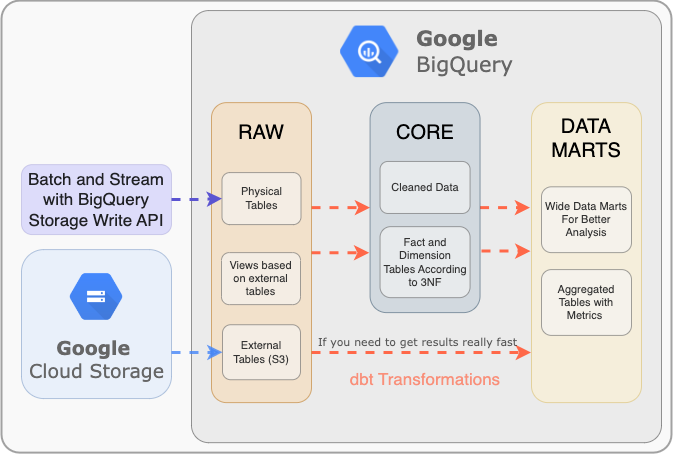
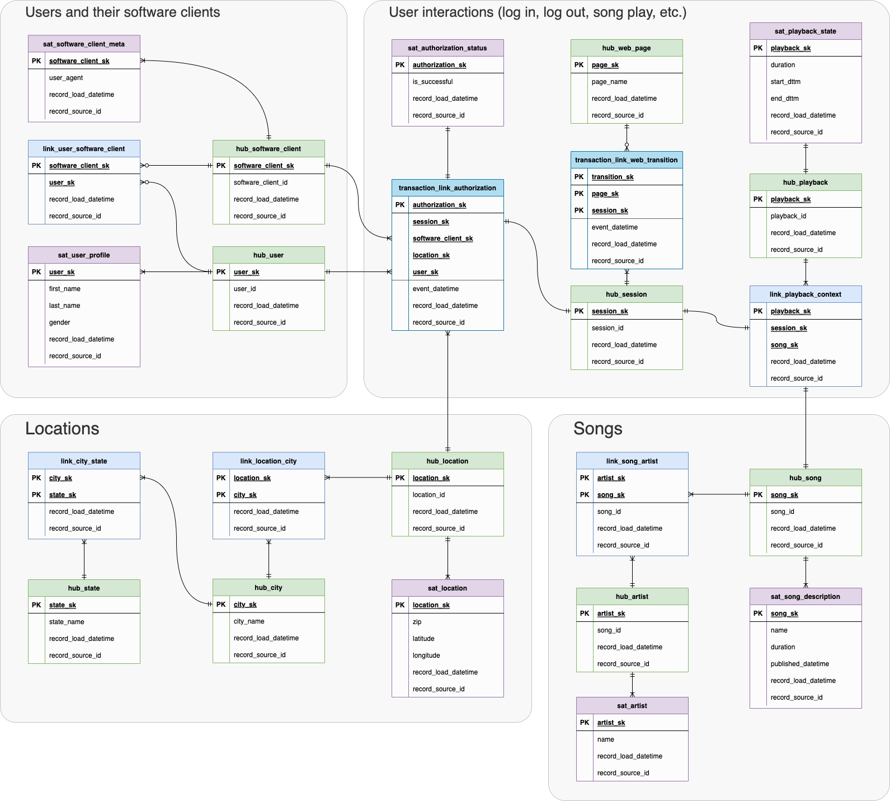
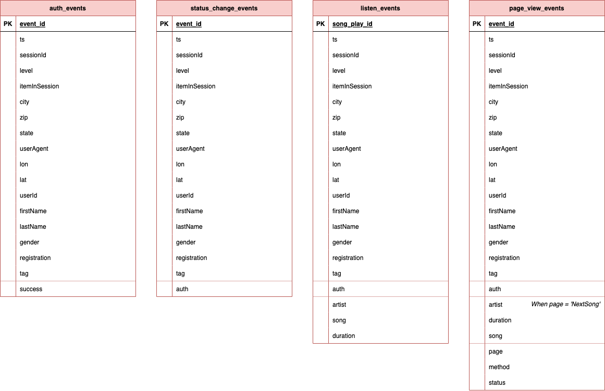

# Data Warehouse Confluence 

## Up Level Diagram

  

  

## Data Areas

### Core

This area contains cleaned and normalized data that reflects business processes, their entities and relationships. 

Data normalized according to the Data Vault 2.0 metology. Implementation is built using dbt with a dbtvault package. Link to implementation: https://github.com/iurii-chernigin/audio-streaming-dbt-datavault

### Data Mart

This area contains wide tables that are useful for analytic research or building machine learning models.

### Raw / Staging 

This area contains data from data sources in raw format. Data looks here as it looks in a source system.

Tables:
- auth_events;
- status_change_events;
- listen_events;
- page_view_events.

